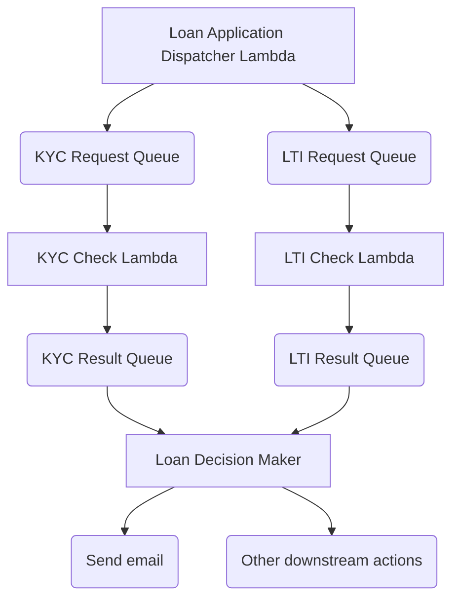

# Loan Application Processing System

## The Loan Application Processing System is a serverless application built using AWS services such as Lambda, SQS, and SES. The system validates loan applications, performs KYC (Know Your Customer) and LTI (Loan to Income) checks, and processes notifications.

### Architecture Overview



### Prerequisites
AWS CLI installed and configured.
Node.js (v18.x or later) installed.
Terraform installed for infrastructure deployment.

### Setup Instructions
- Automated Setup (via Terraform):
```
terraform init
terraform plan
terraform apply
```
- Manual Setup (for Local Testing):

```
cd lambdas/loan_application
npm install
npm run build

cd ../kyc_check
npm install
npm run build

cd ../lti_check
npm install
npm run build

cd ../notification_handler
npm install
npm run build
```

### Running Tests
```
npx jest
```